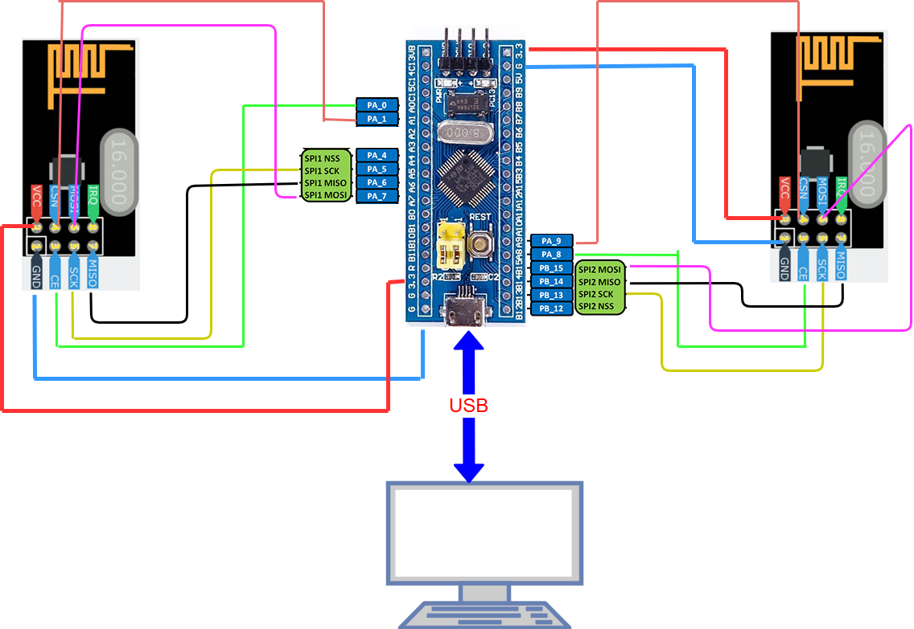
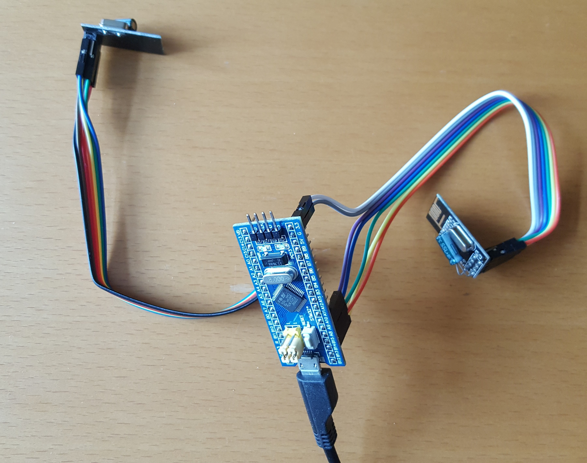

# STM32F103C8_NRF24L01
STM32F103C8 - Blue Pill and two NRF24L01 - RX and TX for check thats works

Files nrf24l01mbal.c and .h there are a little bit modify library of Tilen Majerle (tilen@majerle.eu)
website http://stm32f4-discovery.net
link    http://stm32f4-discovery.net/2015/09/hal-library-25-nrf24l01-for-stm32fxxx/

Actual is possible to connect more than one NRF24L01 to STM32.

